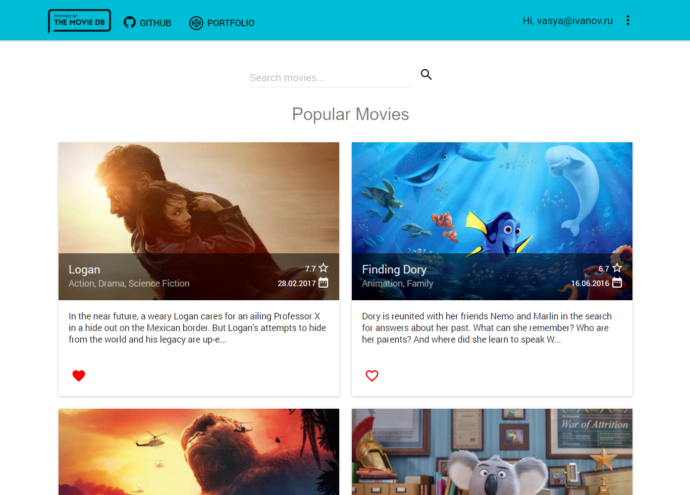

## The MovieDB Redux



This project was bootstrapped with [Create React App](https://github.com/facebookincubator/create-react-app). 
Deployed by  `create-react-app-buildpack`  
Based on `React`, `React-router-redux`, `Redux`, `Material-UI` and `Firebase`

To get started, run following code in your console: 

```
git clone https://github.com/KarafiziArtur/the-movie-db-redux.git
```
```
cd the-movie-db-redux
npm install
```
Then change your `apiKey` of TMDB in `./src/config/theMovieDBConfig.js` and paste the Firebase's `configuration object` in `./src/config/firebaseConfig.js`.  
Then run
```
npm start
```